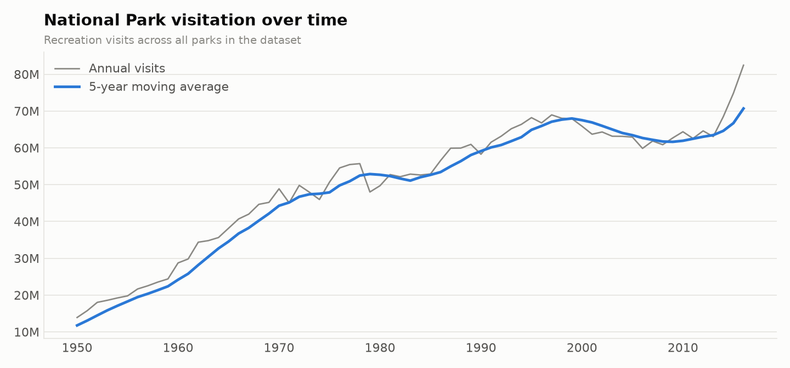
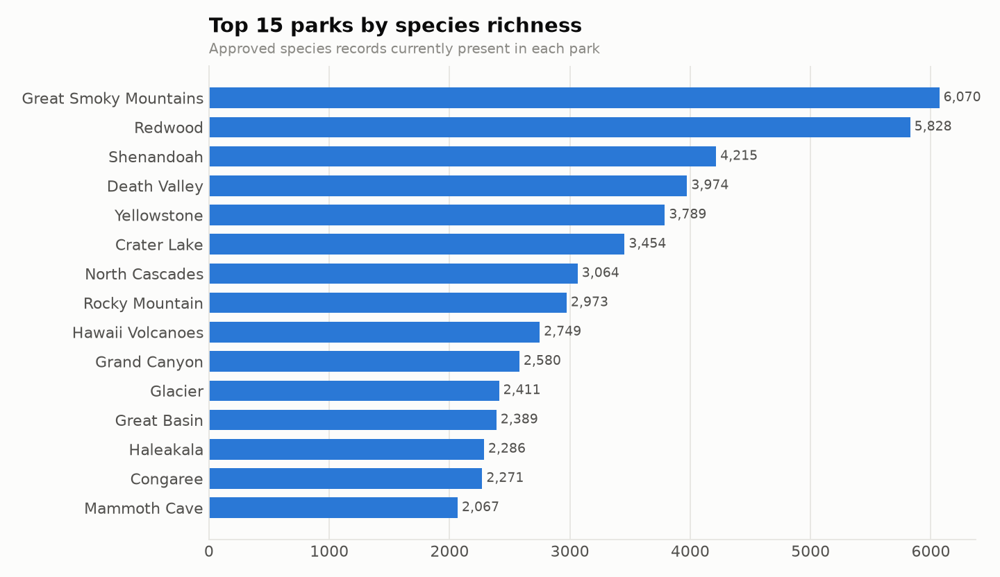
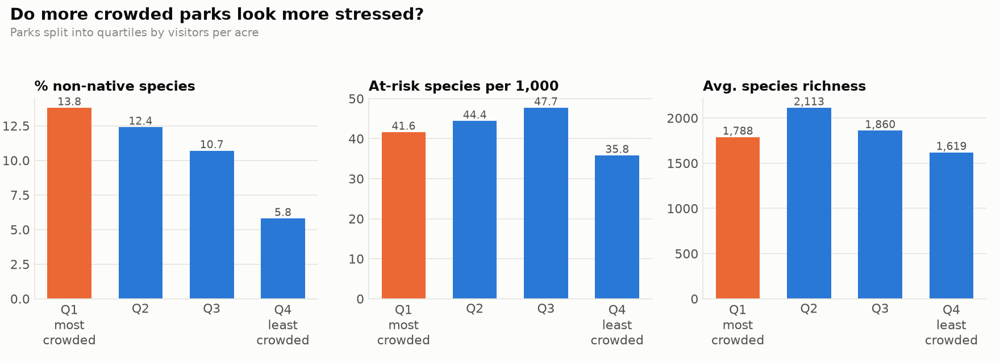
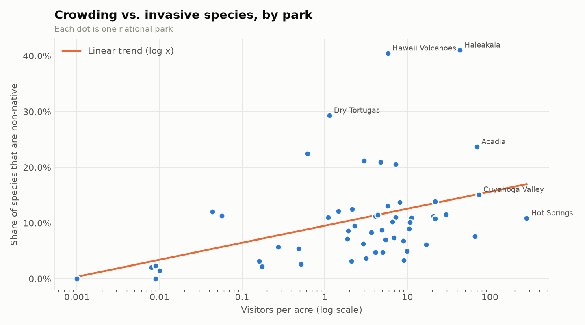
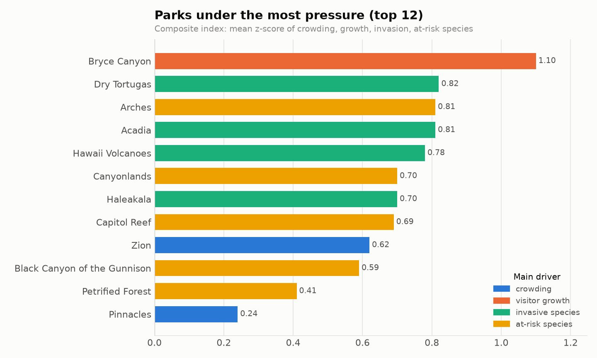
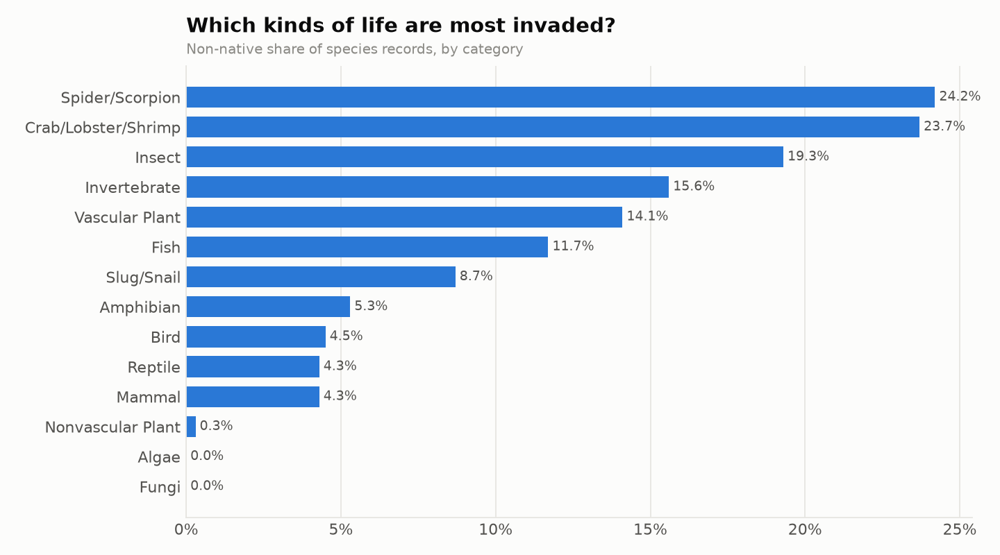
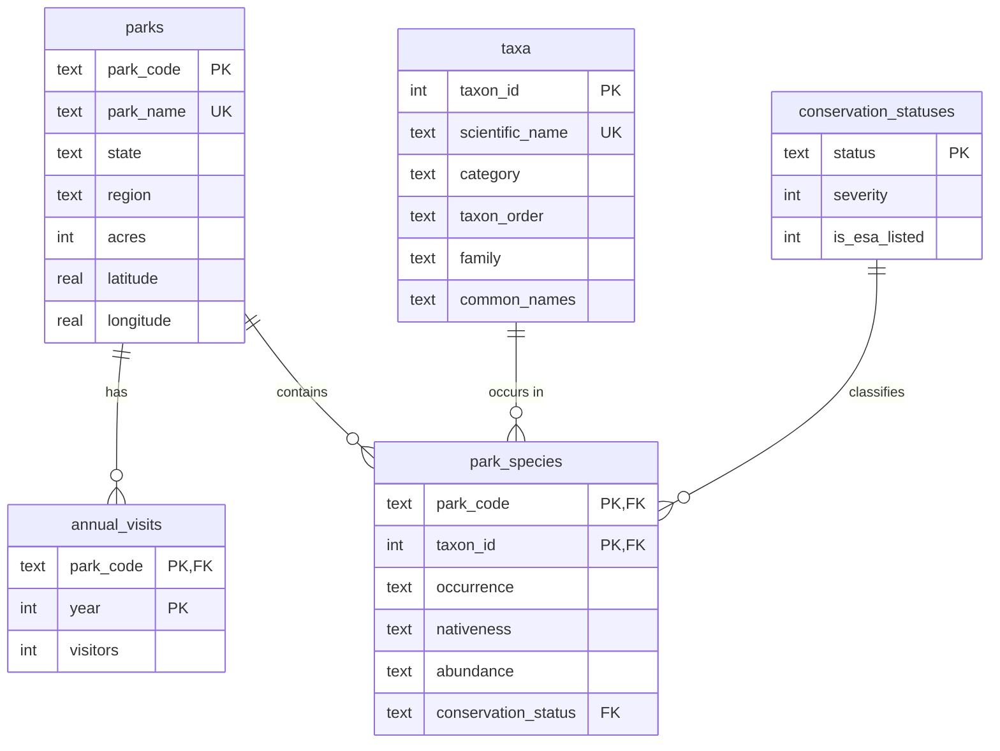

# Loved to Death? Visitor Pressure & Biodiversity in U.S. National Parks

**A SQL-first data analysis of 56 national parks, 119,000+ species records, and 113 years of visitation (1904–2016).**

National park visits keep hitting records, and parks are, among other things, refuges
for thousands of species. This project asks a question most park datasets are never used
to answer: **are the most crowded parks also the most ecologically stressed?** To answer it
I built a normalized SQLite database from two public National Park Service datasets,
wrote a data-quality layer, and answered 15 analytical questions entirely in SQL, ending
in a composite **Pressure Index** that ranks every park by the combined strain of
crowding, visitor growth, invasive species, and at-risk species.

## Headline results

- **Crowded parks are more invaded.** Parks in the most crowded quartile average **13.8% non-native species**, more than double the **5.8%** in the least crowded quartile. Across parks, crowding correlates with non-native share at **r = 0.40**.
- **…but park size explains part of it.** The link survives removing Hawaii's island outliers (r = 0.42) yet falls to **r = 0.22 after controlling for park size**: small parks are both more crowded and easier to invade.
- **Crowding spans five orders of magnitude**, from **278 visitors per acre** at Hot Springs to **0.001** at Gates of the Arctic.
- **Bryce Canyon tops the Pressure Index**, driven by **10.3% annual visitor growth** over a decade; Dry Tortugas, Arches, Acadia, and Hawaii Volcanoes follow.
- **Redwood is irreplaceable**: it shelters **2,937 species recorded in no other national park**, and is also a top "hidden gem" (5,828 species, only ~536k visitors).
- **Total visitation hit a record 82.5 million in 2016**, up 37.8% in a decade.

Full write-up: [`reports/FINDINGS.md`](reports/FINDINGS.md), regenerated from the query
outputs on every run so the numbers can never drift from the SQL.

---

## Questions answered

| # | Question | SQL techniques |
|---|----------|----------------|
| Q01 | What does the dataset cover? | scalar subqueries |
| Q02 | Which parks hold the most biodiversity, raw and per acre? | conditional aggregation (pivot), `RANK()` |
| Q03 | Which kinds of life (birds, plants, fish…) are most invaded? | filtered aggregates, share-of-total window |
| Q04 | Where are endangered and threatened species concentrated? | CTEs, `DENSE_RANK()`, `ROW_NUMBER()` top-N per group |
| Q05 | Which parks are most invaded by non-native species? | `NTILE()`, deviation from window average |
| Q06 | How has total visitation changed over time? | `LAG()`, 5-year moving-average window frame |
| Q07 | Which parks are growing fastest? Biggest one-year surge? | CAGR with `power()`, partitioned `LAG()` |
| Q08 | Which parks are most crowded *relative to their size*? | derived density metric, `PERCENT_RANK()` |
| **Q09** | **Do crowded parks show more ecological stress?** | quartile bucketing + comparison |
| Q10 | How strong are those relationships? | **Pearson correlation computed from scratch in SQL** |
| Q11 | Which parks are ecological "twins"? | self-join, **Jaccard similarity** |
| Q12 | Which parks shelter species found nowhere else in the system? | `HAVING count(*) = 1` singleton detection |
| **Q13** | **Which parks are under the most pressure overall?** | **z-score standardization, composite index** |
| Q14 | Where can you see the most wildlife with the fewest crowds? | percentile filters, recommendation framing |
| **Q15** | **Does the main finding survive robustness checks?** | **partial correlation (controlling for size) in SQL** |

Every query lives in [`sql/analysis/`](sql/analysis) with a header stating the question,
the technique, and why it matters.

---

## Results

<!-- Figures are generated by `python run.py analyze`. -->
| | |
|---|---|
|  |  |
|  |  |
|  |  |

---

## Data model

Raw CSVs land in all-`TEXT` staging tables (so loading never fails on dirty values);
all typing, cleaning, and deduplication then happens in SQL.



A semantic layer of views ([`sql/03_views.sql`](sql/03_views.sql)) defines the business
rules once (e.g. *a species counts only if it is currently present, not a historical or
false report*) and exposes `v_park_scorecard`, one analysis-ready row per park.

### Cleaning decisions
Problems found in the raw data, and how each was handled:
- **Column-shifted rows.** In 57 species rows a comma inside the common name pushes every later field one column right (that is how values like "Breeder" ended up in the conservation-status column). The loader detects and repairs them ([`src/build.py`](src/build.py)).
- **One park, two codes.** Sequoia & Kings Canyon is a single park in the species data (`SEKI`) but reported as `SEQU` + `KICA` in the visitation data. An alias table maps and sums them.
- **Uneven record review.** 28% of species records are "In Review" rather than "Approved", ranging from 0% in some parks to **75% in Redwood**. Filtering to approved records would have silently erased most of Redwood's species, so presence is decided by the `occurrence` field instead.

In SQL ([`sql/02_transform.sql`](sql/02_transform.sql)):
- **155 duplicate park-species rows** are resolved with `ROW_NUMBER()`, preferring approved records and then the most severe conservation status, so at-risk species are never under-counted.
- **Inconsistent taxonomy** (the same scientific name labeled differently across parks) is resolved by majority vote.
- **Visitation** keeps only National Park units and real year rows, dropping the per-unit `Total` rows that would otherwise double-count.
- **Unknown conservation statuses** are nulled and counted by the data-quality report instead of silently disappearing.

### Data quality
[`sql/04_data_quality.sql`](sql/04_data_quality.sql) runs on every build and writes a
PASS / WARN / FAIL report to `results/00_data_quality.csv` covering row counts, join
coverage, deduplication, unmapped categories, and value ranges. A FAIL stops the pipeline.

---

## Methodology notes

- **Crowding** = latest-year recreation visits ÷ park acres. It is log-transformed for correlations and the index because it spans several orders of magnitude.
- **At-risk species** = conservation severity 2–5 (Species of Concern through Endangered). **ESA-listed** = Endangered or Threatened under the Endangered Species Act.
- **Pressure Index** = mean of four z-scores (log crowding, 10-year visitor CAGR, non-native share, at-risk species per 1,000). Equal weights keep it transparent; the components are reported alongside so readers can see what drives each park's score.
- **Correlation** is computed in SQL as `(E[xy] − E[x]E[y]) / (σx·σy)` and verified against Python's `statistics.correlation` in the test suite.

## Limitations

- **Association, not causation.** A link between crowding and invasive species could reflect visitors spreading seeds, or simply that accessible, developed parks were disturbed long before tourism grew.
- **Survey effort bias.** Heavily visited parks are often better studied, so they may record more species of every kind, including rare and non-native ones.
- **Time alignment.** The species lists are a single snapshot, while visitation covers 1904–2016; the analysis uses each park's most recent visitation year.
- **Park size confounds** several metrics; Q10 reports size correlations and Q15 controls for size explicitly, which cuts the crowding–invasion correlation roughly in half.
- **Small categories are noisy.** Invasion rates for small categories (e.g. spiders) rest on far fewer records than plants or birds.

---

## Run it yourself

Requires Python 3.10+ (SQLite is built in; no database server needed).

```bash
git clone <this repo> && cd national-parks-sql
python -m venv .venv && source .venv/bin/activate
pip install -r requirements.txt

python run.py all        # download → build database → run analyses
```

`run.py download` fetches the visitation file automatically. The biodiversity data is
on Kaggle, which requires a free account: either download `archive.zip` from the
[dataset page](https://www.kaggle.com/datasets/nationalparkservice/park-biodiversity) into
`data/raw/`, or set up the Kaggle CLI and the script will fetch it. See
[`data/README.md`](data/README.md).

Outputs:

```
data/national_parks.db    the database: open it in DB Browser for SQLite, DBeaver, or VS Code
results/*.csv             one table per query, plus park_scorecard.csv
figures/*.png             charts above
reports/FINDINGS.md       auto-written summary of results
```

Run the tests (synthetic fixture, no download needed):

```bash
python -m unittest discover tests -v
```

## Project structure

```
national-parks-sql/
├── run.py                     # CLI: download | build | analyze | all
├── sql/
│   ├── 01_schema.sql          # staging + model tables, constraints, indexes
│   ├── 02_transform.sql       # cleaning, dedup, loading
│   ├── 03_views.sql           # semantic layer / business rules
│   ├── 04_data_quality.sql    # automated DQ report
│   └── analysis/q01–q15.sql   # one file per question
├── src/                       # thin Python wrapper: load CSVs, run SQL, chart, report
├── tests/                     # end-to-end tests on a generated synthetic fixture
├── data/raw/                  # source CSVs (git-ignored)
├── results/ figures/ reports/ # generated outputs
```

## Data sources

- **NPS species lists**: *Biodiversity in National Parks*, National Park Service via Kaggle ([link](https://www.kaggle.com/datasets/nationalparkservice/park-biodiversity)); originally from NPSpecies.
- **NPS visitation**: annual recreation visits by unit, 1904–2016, compiled by [TidyTuesday (2019-09-17)](https://github.com/rfordatascience/tidytuesday/tree/master/data/2019/2019-09-17) from NPS IRMA statistics.

---

*Author: Luis Reynoso*
